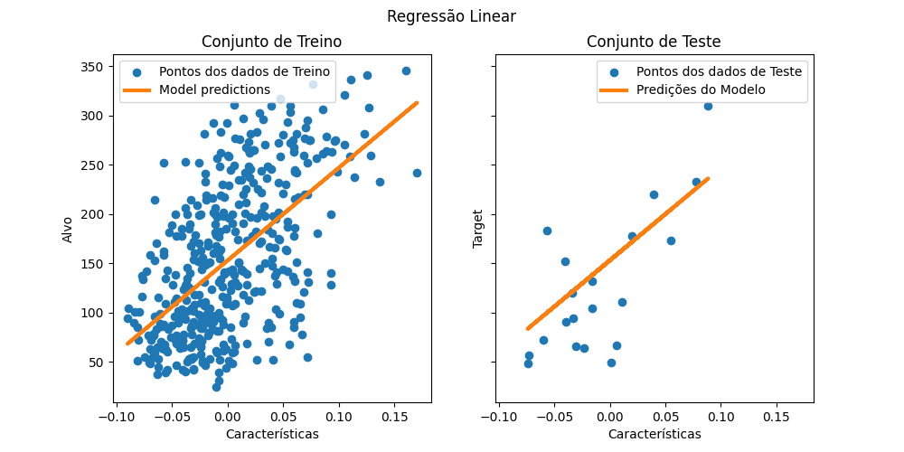

# Modelos Lineares

## 1 - Regressão Linear
A **regressão linear** é um método em que se espera que o valor alvo seja um **combinação** linear dos dados.
Isso significa que: ŷ(w,x) = w0 + w1x1 + ... + wnxn. Onde
o vetor w = (w1, w2,...,wn) é denominado vetor coef_ e w0 é o intercept_

### 1.1 - Mínimos Quadrados Ordinários

A função LinearRegression ajusta um modelo linear com coeficientes w = (w1, w2,...,wn)
para minimizar a soma residual dos quadrados entre os alvos observados no conjunto de dados e os alvos previstos pela
aproximação linear. É uma técnica comum para encontrar a melhor linha reta (ou hiperplano, no caso de mais de uma variável) 
que se ajusta aos dados. Essa linha representa a relação entre as variáveis independentes (input) e a variável dependente 
(output). A ideia é minimizar a diferença entre as previsões do modelo e os valores reais observados. Matematicamente 
ela resolve um problema da forma: min ||X*w-y||2, onde: 
- X são as variáveis independentes (features), representadas por uma **matriz** de m exemplos por n características (dimensões).
- y são os valores observados da variável dependente (output). Também é representada por uma matriz.

Em resumo, o algoritmo de Mínimos Quadrados Ordinários tem como objetivo encontrar o melhor conjunto de coeficientes 
**w** para a regressão linear, de maneira que a soma dos quadrados das diferenças entre os valores previstos e os valores 
reais seja a menor possível.

### 1.2 - Regularização

Devemos ter em mente sempre que:
 
- O overfitting (superajuste) ocorre quando o modelo tem bom desempenho no conjunto de treinamento, mas não tão bom nos
dados não vistos (teste).
- A subadaptação (underfitting) ocorre quando o desempenho não é bom nem no conjunto de treinamento nem no conjunto de 
teste.

Esses dois fenômenos ocorrem devido ao ajuste dos pesos w = (w1, w2,...,wn). Objetivando 
evita-los, há diferentes maneiras de reduzir a complexidade do modelo e evitar o ajuste excessivo em modelos lineares: 
regressão ridge e regressão lasso.

#### 1.2.1 - Lasso

É também conhecido como método de regressão penalizada. Lasso é a abreviação de Least Absolute Shrinkageand Selection 
Operator (operadorde seleçãoe redução mínima absoluta), que é usado tanto para regularização quanto para seleção de 
modelos. Se um modelo usar a técnica de regularização L1, ele será chamado de regressão lasso.

